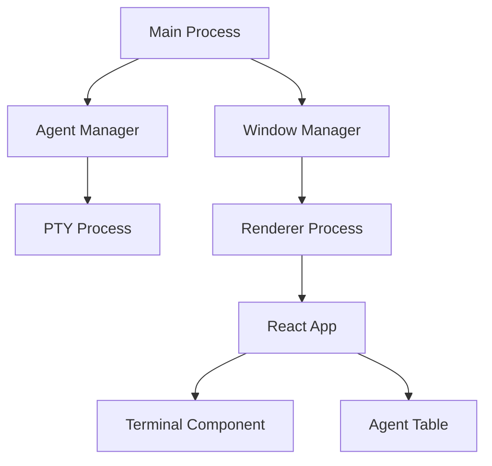

# Task 11: User and Developer Documentation

## Task Description
Create comprehensive documentation for both end users and developers. This includes user guides, installation instructions, API documentation, contribution guidelines, and architectural overviews. Documentation should be clear, searchable, and maintained alongside the code.

## Priority: P1 (Should Have)
## Estimated Effort: 3-4 days

## Acceptance Criteria
- [ ] README.md with quick start guide
- [ ] Detailed installation instructions for all platforms
- [ ] User guide with screenshots and examples
- [ ] Keyboard shortcut reference
- [ ] Troubleshooting guide
- [ ] Developer setup instructions
- [ ] Architecture documentation
- [ ] API reference for extensions
- [ ] Contributing guidelines
- [ ] Documentation website (optional)

## Technical Implementation Notes

### Documentation Structure
```
docs/
├── user/
│   ├── installation.md
│   ├── getting-started.md
│   ├── features.md
│   ├── keyboard-shortcuts.md
│   └── troubleshooting.md
├── developer/
│   ├── setup.md
│   ├── architecture.md
│   ├── api-reference.md
│   ├── testing.md
│   └── contributing.md
├── images/
│   ├── screenshots/
│   └── diagrams/
└── README.md
```

### Documentation Tools
- Markdown for all documentation
- Mermaid for diagrams
- Screenshot tool for visuals
- JSDoc for code documentation
- Typedoc for API generation

## Dependencies on Other Tasks
- All features must be complete
- Task 10: Testing (document test procedures)

## Subtasks

### 11.1 README Creation (3 hours)
- Write compelling project description
- Add feature highlights
- Create quick start section
- Add screenshots/GIFs
- Include badges (build, coverage)

### 11.2 Installation Guide (4 hours)
- Document system requirements
- Provide platform-specific instructions
- Include Claude Code setup
- Add verification steps
- Troubleshoot common issues

### 11.3 User Guide (6 hours)
- Document all features
- Create workflow examples
- Add annotated screenshots
- Explain status indicators
- Include tips and tricks

### 11.4 Keyboard Reference (2 hours)
- List all shortcuts
- Group by category
- Show platform differences
- Create printable cheatsheet
- Add customization guide

### 11.5 Troubleshooting Guide (3 hours)
- Common issues and solutions
- Error message explanations
- Performance optimization tips
- Debug mode instructions
- Support contact information

### 11.6 Developer Documentation (6 hours)
- Development environment setup
- Architecture overview
- Code organization
- Build process explanation
- Debugging techniques

### 11.7 API Documentation (4 hours)
- Generate from TypeScript
- Document extension points
- Provide code examples
- Explain plugin system
- Version compatibility

### 11.8 Contributing Guide (2 hours)
- Code of conduct
- Development workflow
- PR guidelines
- Code style guide
- Issue templates

### 11.9 Visual Assets (3 hours)
- Create screenshots
- Record demo GIFs
- Draw architecture diagrams
- Design workflow charts
- Create logo/branding

### 11.10 Documentation Site (3 hours)
- Set up static site generator
- Configure search
- Deploy to GitHub Pages
- Set up auto-deployment
- Add analytics

## Documentation Templates

### Feature Documentation Template
```markdown
# Feature Name

## Overview
Brief description of what the feature does

## How to Use
Step-by-step instructions

## Screenshots
Visual examples

## Tips
Best practices and shortcuts

## Troubleshooting
Common issues and solutions

## Related Features
Links to related documentation
```

### API Documentation Example
```typescript
/**
 * Spawns a new Claude Code agent in the specified directory
 * @param workingDir - The directory to start the agent in
 * @returns Promise<string> - The unique agent ID
 * @throws {Error} If Claude Code is not installed
 * @example
 * const agentId = await agentManager.spawnAgent('/home/user/project');
 */
async spawnAgent(workingDir: string): Promise<string>
```

## User Documentation Sections

### Getting Started
1. Installation prerequisites
2. First launch
3. Adding your first agent
4. Understanding the interface
5. Basic workflows

### Feature Deep Dives
- Multi-agent management
- Status detection explained
- Session persistence
- Keyboard navigation
- Customization options

### Common Workflows
- Managing multiple projects
- Switching between agents
- Monitoring agent status
- Saving and restoring sessions
- Troubleshooting agents

## Developer Documentation Sections

### Architecture Overview


### Extension Development
- Plugin architecture
- Available hooks
- Example plugins
- Publishing guidelines
- API stability

## Documentation Quality Checklist
- [ ] Clear and concise language
- [ ] No assumed knowledge
- [ ] Plenty of examples
- [ ] Up-to-date screenshots
- [ ] Tested instructions
- [ ] Accessible formatting
- [ ] Search-friendly headings
- [ ] Cross-references

## Maintenance Plan
- Review with each release
- Update screenshots quarterly
- Test installation steps
- Gather user feedback
- Track documentation bugs

## SEO Optimization
- Descriptive headings
- Keyword placement
- Meta descriptions
- Alt text for images
- Structured data

## Risk Mitigation
- **Risk**: Outdated documentation
  - **Mitigation**: Automated checks, version tags
- **Risk**: Missing information
  - **Mitigation**: User feedback system
- **Risk**: Poor discoverability
  - **Mitigation**: Good search, clear navigation

## Future Enhancements
- Video tutorials
- Interactive demos
- Localization
- In-app help system
- Community wiki

## Notes
- Keep language simple and clear
- Use consistent terminology
- Include plenty of examples
- Test all instructions
- Update with each feature change